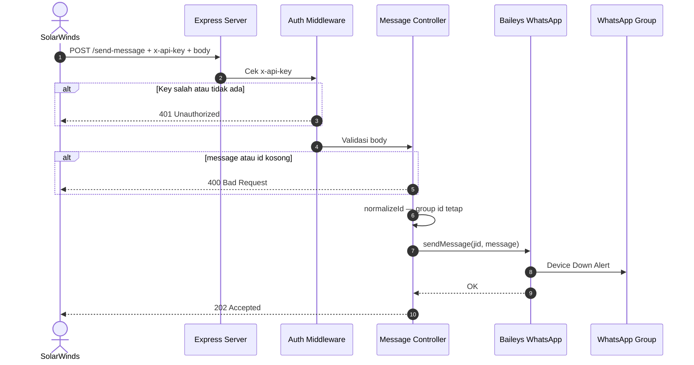

# Alert Flow — SolarWinds → WhatsApp Group



---

## Contoh Request SolarWinds

```http
POST http://<gateway-host>:3000/send-message
Content-Type: application/json
Authorization: Bearer your_api_key_here

{
  "message": "🚨 *Device Down Alert*\n\n*Device :* Core-Switch-01\n*IP Address :* 10.10.10.1\n*Status :* DOWN\n\n*Location :* Jakarta DC\n*Down Time :* 2026-04-10 09:15:23 AM",
  "id": "120363423274966961@g.us"
}
```

Response:
```json
{
  "success": true,
  "jobId": "direct-1234567890",
  "message": "Message queued successfully",
  "destination": "120363423274966961@g.us",
  "type": "group"
}
```
